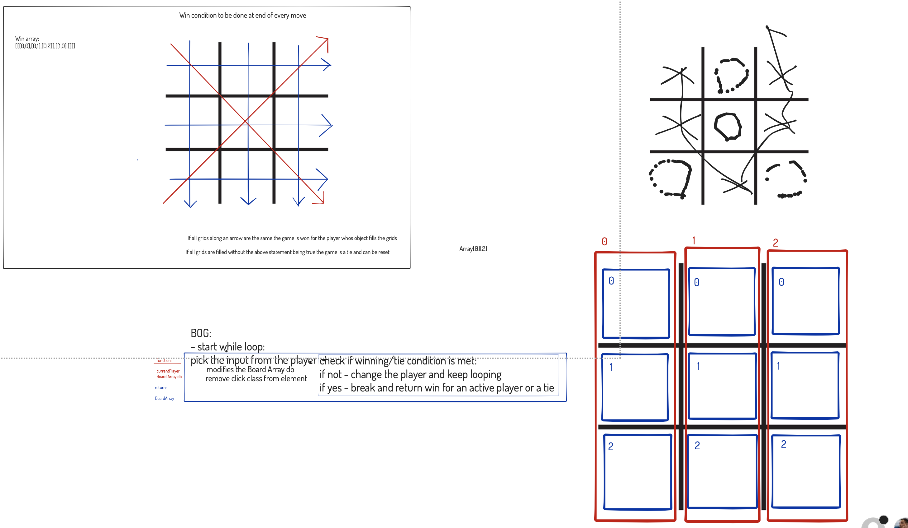

## Tic Tac Toe game
#### *Epicodus Practice lesson #24 (Week 4) on 1/27/2021*
***By Daniel Adeyemi, Jonah Johansen,  Woo Jin Kim***
___
### *This project is not in a complete or portfolio ready state, and should not be considered as representation of professional work.*
---
## *Description:*
### *{Some concise description}* 
This web page will ...

## *Blueprint of bussiness logic*

## *Tests*

**Describe: `constractor Player() {score and mark}`**   
**Describe: `constractor GameBoard() {2D array}`**
**Describe: `constractor Game() {players, higher score, game status, turn}`**      
#### Test 1:
**Describe: `Game.prototype.generateBoard()`**
**Test:** *Return a new 2D array*   
**Expect:** *game.generateBoard.toEqual([[],[],[]])* 
#### Test 2:  
**Describe: `GameBoard.prototype.add(x,y, mark)`** 
**Test:** *Add players's mark into an array*   
**Expect:** *gameBoard.add(x,y, 'O).toEqual(gameboard[x][y] === 'O')* 
#### Test 3:
**Describe: `GameBoard.prototype.value(x,y)`**   
**Test:** *Will return a position inside an array(aka gameboard)*   
**Expect:** *gameBoard.value(2,0).toEqual(gameboard[2][0])*   
#### Test 4:   
**Test:** *...*   
**Expect:** *function(???).toEqual(???)* 

**Describe: `function()`**   
#### Test 1:
**Test:** *...*   
**Expect:** *function(???).toEqual(???)* 
#### Test 2:   
**Test:** *...*   
**Expect:** *function(???).toEqual(???)* 
#### Test 3:   
**Test:** *...*   
**Expect:** *function(???).toEqual(e)*   
#### Test 4:   
**Test:** *...*   
**Expect:** *function(???).toEqual(???)* 

## *Setup instructions:*
#### From the web:
* Go to my GitHub repository, using following [URL](#).
* Click the "Code" and click the 'Download zip' option.
* Unzip the file, navigate to the root directory.
* open ***'index.html'*** file with your web browser.
#### From the terminal: 
* Clone my repository from GitHub using `git clone #`
* Navigate to the downloaded folder using ***cd*** command
* Execute **code .** command in your terminal and it will open all source code in your code editor.    
*Note: please, make sure that you are inside project directory!*
#### GitHub pages:
*GitHub page is unavailable for this project*

## *Tecnologies used:*
* HTML
* CSS
* Java Script
* JQuery
* Bootstrap *v5.0.0 beta*
* Git and GitHub

## *Known bugs:*
This project has almost no style and was used only for practice purporse.

## *License and copyright:*

> ***© Daniel Adeyemi, Jonah Johansen,  Woo Jin Kim, 2021***   
> *Licensed under [MIT license](https://mit-license.org/)*